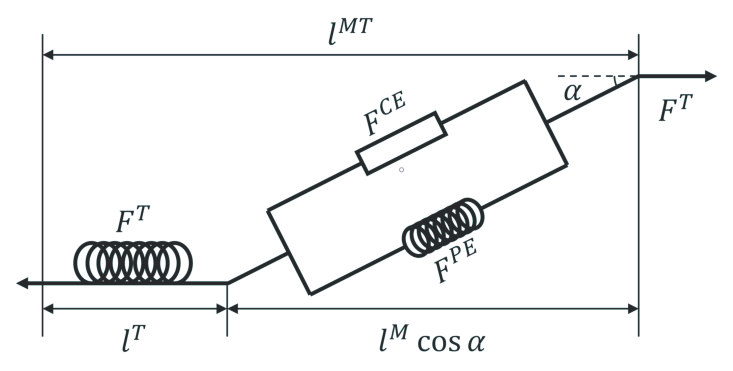
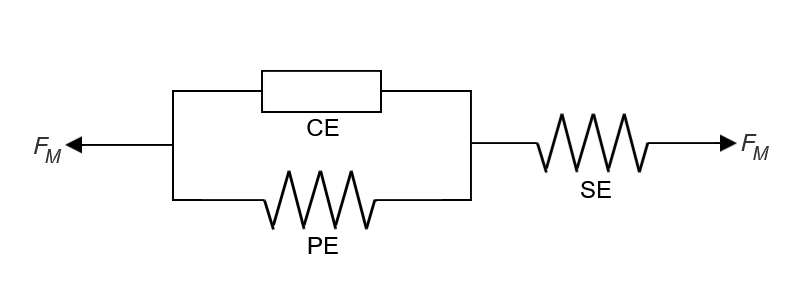
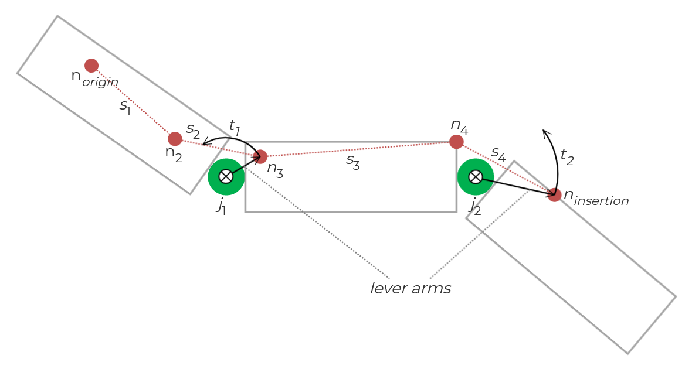

# Fundamentals

## Model Architecture

This section primarily aims to provide a high-level introduction of the muscle model used in Kinesis. For mathematical details, please consult the [cited literature](10-bibliography.md#bibliography) and source code.

### Introduction to Hill-Type Muscle Models

The term "Hill-type muscle model" refers to a certain formulation of muscle dynamics model typically composed of a system of contractile, parallel, and serial components whose configurations can vary depending on the exact model.

The history of the Hill-type model stretches back to muscle research in the early 20th century and a paper by [(Hill, 1938)](/10-bibliography.md) describing the original muscle model. Due to limited insight into the internal structure and functioning of skeletal muscles, the Hill-type model developed as a [phenomenological model](https://en.wikipedia.org/wiki/Phenomenological_model) that treats internal muscle dynamics as a "black box," instead layering its own system of mechanical components to approximate *observed* characteristics of muscle behavior.

|  |
| :----------------------------------------------------------: |
| [*Figure 1 - Structure of a Hill-Type Muscle Model*](https://www.researchgate.net/figure/Structure-of-a-Hill-type-muscle-model-F-CE-and-F-PE-are-the-active-and-passive-forces_fig1_334812764) by (Zhou, et al., 2019) is licensed under [CC BY 4.0](https://creativecommons.org/licenses/by/4.0/) |

As indications of their somewhat contrived nature, Hill-type models are typically massless, and component elements are often described by comparison to spring and dashpot assemblies. Although the basis for these models may seem dated, they can still provide insightful results, and remain popular because they are relatively easy to understand and work with.

We'll start by looking at the three-element Hill-type model in Kinesis. This model typically consists of a contractile element (CE) in combination with two nonlinear spring elements: one called the parallel element (PE) as it is parallel to the CE, and one called the serial element (SE) as it is in series in relation to both the CE and PE. Hill-type models commonly approach muscle dynamics by focusing on muscle contraction force, which depends on the muscle's physical state at any given moment (mainly CE length and contraction velocity).

|  |
| :----------------------------------------------------------: |
|       *Figure 2 - Three-Element Hill Model in Kinesis*       |

Relating each element to a biological analogue may be helpful:

- The CE can be seen to represent the muscle fibers that contract under activation.
- The PE can be seen to represent passive elastic connective tissue around the contractile muscle fibers that resist stretching or compression. Being passive means that the element does not respond directly to activation.
- The SE can be seen to represent the (also passive and elastic) tendinous material that attaches muscle to bone.

A reminder that these biological interpretations are merely mental conveniences. Real biological muscle structure and function is much more complex, featuring dynamics often overlooked in Hill-type models.

Also, as a clarifying note if you're exploring the literature for the first time, PE and SE elements often only consist of a parallel *elastic* element (PEE) and a serial *elastic* element (SEE) respectively, but some models may also feature a parallel damping element (PDE) or even a serial damping element (SDE); both the elastic and damping elements are typically considered components of their broader respective elements (i.e. the PE consists of both the PEE and SDE, and the SE consists of both the SEE and SDE).

### Overview of the Multi-Segment Hill-Type Muscle Model in Kinesis

The model in Kinesis is heavily based on the descriptions in [(Geijtenbeek, et al., 2013)](/10-bibliography.md), but its construction was informed by multiple papers and required further accommodations to operate smoothly in Unity.

In this multi-segment model, the muscle's physical path is described by a series of muscle nodes—point positions defined on the character model—that link together as muscle segments. Segments with nodes defined on separate adjacent bodies are said to *span* the joint connecting the bodies. These segments are used when calculating the joint torques generated by the muscle.

To drive the muscle dynamics, each muscle receives an *excitation signal* which is then mapped by some defined *activation dynamics* into a *muscle activation*, which controls muscle contraction activity. As a muscle contracts or relaxes, both the length of the CE and the velocity of contraction are used to determine the generated contractile force, which is in turn used to calculate the joint torques generated by the muscle.

The joint torque calculations are based on the following definitions. The muscle's contractile force (which the model outputs as a scalar magnitude value) is applied down the line of action, which is defined from the muscle segment's tail position (the one with the higher index) toward its head position. To put it another way, the muscle's contractile force scales the line of action unit vector. The lever arm is simply the vector from the joint position toward the [spanning] muscle segment's tail position.

|  |
| :----------------------------------------------------------: |
|           *Figure 3 - Multi-segment muscle model*            |

## Core

This section primarily aims to provide a basic overview of the core muscle model implementation. For detailed code documentation, please refer to the [API documentation]() and the source code.

### Concepts

Please refer to the [Overview of the Multi-Segment Hill-Type Muscle Model in Kinesis](#overview-of-the-multi-segment-hill-type-muscle-model-in-kinesis) for a conceptual overview.

### Code Structure

In the `Kinesis/Scripts/Core` directory, you should find three scripts that comprise the core implementation of the muscle model:

- `MuscleNode.cs`: Contains the `MuscleNode` class representing muscle nodes.
- `MuscleSegment.cs`: Contains the `MuscleSegment` class representing muscle segments.
- `MuscleTendonUnit.cs`: Contains the `MuscleTendonUnit` [Monobehaviour](https://docs.unity3d.com/ScriptReference/MonoBehaviour.html) class implementing the actual muscle model.

The primary concern of this section is describing the implementation of the `MuscleTendonUnit` class.

- The public `muscleNodes` and `muscleSegments` fields on `MuscleTendonUnit` contain the data representing the muscle path.

  > **Note:** The associated `MuscleTendonUnitEditor` script listens for muscle node changes and should automatically trigger a rebuild of the list of muscle segments.

  > **Caveat:** Currently, a **Muscle Segment** should not be defined such that it would span more than a single joint.

- The `CalculateJointTorques()` and `ApplyJointTorques()` methods are used to iterate the muscle simulation step-by-step and are intended to be called inside `FixedUpdate()`. The functionality was separated between calculation and application to allow for more control and extensibility.

- The `CalculateJointTorques()` method receives an excitation to drive the muscle dynamics and a dictionary to contain the necessary data to apply the calculation results.

- The `ApplyJointTorques()` method receives a dictionary in the form that `CalculateJointTorques` uses, then parses that dictionary to apply the calculated joint torques to the proper rigid bodies.
